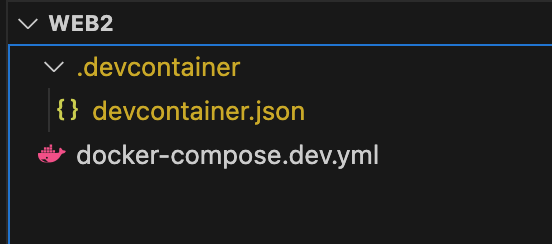

# Docker Dev Container

Avant la création de notre API, il serait intéressant de créer un environnement de développement qui :

* facilement duplicable d'un ordinateur à l'autre
* indépendant du système d'exploitation
* contient le set de dépendances du projet (les versions des paquets par exemple)

Notamment, nous allons créer un API avec NodeJS (v.18) qui tourne en Ubuntu Linux (bullseye).

Nous utilisons Docker et VSCode afin de satisfaire ces demandes via leur [Dev Containers](https://code.visualstudio.com/docs/devcontainers/containers).

Il faut d'abord installer Docker et VSCode avant de procéder aux étapes suivantes. Un guide complèt se trouve [ici](https://docs.glassworks.tech/unix-shell/introduction/010-introduction/installation-party).

On crée un container qui tourne une version du système d'exploitation et interprète de notre choix. Idéalement, ce seront les mêmes que l'on utilisera en production (par exemple, Ubuntu Linux).

VSCode s'attache à ce container de plusieurs façons :

* on monte le dossier de notre projet (en local) dans le container via l'élément `volumes` de `docker compose`.
* quand on ouvre un terminal dans VSCode, c'est l'équivalent de lancer un `docker exec -it [ID du container]`. On lance donc un interprète _dans le container_. On peut ensuite installer et lancer des processus provenant de notre développement (par exemple, lancer l'API) dans son environnement précis.

Pour accomplir tout cela, VSCode exige la présence d'un dossier `.devcontainer` à la racine du workspace.

Nous commençons donc par créer ce dossier dans notre dossier de travail, et en ajoutant un fichier `.devcontainer/devcontainer.json` dedans :


```json
{
  "name": "API Code Samples",
  // Pointer vers notre docker-compose.dev.yml
  "dockerComposeFile": [
    "../docker-compose.dev.yml"
  ],
  // Le service dans docker-compose.dev.yml auquel on va attacher VSCode
  "service": "vscode_api",
  // Le dossier de travail précisé dans Dockerfile.dev
  "workspaceFolder": "/home/dev",
  // Set *default* container specific settings.json values on container create.
  "customizations": {
    "settings": {},
    "extensions": []
  },
  // Quelques extensions VSCode à inclure par défaut pour notre projet 
  "forwardPorts": [ 5050 ]
}
```


Si on analyse bien ce fichier, on voit que VSCode va consulter un fichier `docker-compose.dev.yml` qui existe dans le répertoire parent pour lancer les services nécessaires pour ce parent.

Ce docker-compose pourrait à la fois contenir un service pour notre VSCode, mais aussi une base de données (de l'image mariadb), et d'autres services comme **redis**, ou autre.

Pour le moment, nous créons uniquement le service pour VSCode, qui doit porter le même nom que le champ `service` dans `devcontainer.json`.


```yaml
services:
  vscode_api:
    image: rg.fr-par.scw.cloud/api-code-samples-vscode/vscode_api:2.0.1
    command: /bin/bash -c "while sleep 1000; do :; done"
    working_dir: /home/dev
    networks:
      - api-network
    volumes:
      - ./:/home/dev:cached
    labels:
      api_logging: "true"      
    
```


Remarquez le service `vscode_api`, qui finalement tourne une commande `/bin/bash` en boucle infinie. VSCode s'attache à ce service. Le container est créé à partir d'une image que je vous ai déjà crée.

Nous sommes prêts à lancer notre Dev Container. Vérifiez bien la structure de votre projet VSCode.

<figure><figcaption></figcaption></figure>

Vous pouvez ensuite lancer votre Dev Container en appuyant sur **F1**, et puis **Dev Containers : Rebuild and Reopen in Container**.

<figure><figcaption></figcaption></figure>

Une fois lancé, ouvrez un nouveau terminal.

Vous allez voir que NodeJS est déjà installé :

```bash
node -v
# v20.18.0
```

Au passage, nous avons installé **mycli** aussi, car on va travailler avec un SGBDR :

```bash
 mycli --version
 # Version: 1.26.1
```

Pour utiliser **typescript**, nous avons aussi ajouté **ts-node** et **typescript** comme commandes globales :

```bash
ts-node -v
# v10.9.2

tsc -v
# Version 5.7.3
```


Si vous avez des difficultés à démarrer votre dev-container, essayez ce qui suit :

- Ouvrez le Docker Dashboard, et essayez de supprimer tous les conteneurs qui pourraient être en conflit avec votre conteneur.
- Essayez de lancer `docker system prune -a --volumes` pour vider toutes les caches locales
- Redémarrez Docker
- Redémarrez votre ordinateur



## L'image Docker

**Remarque : il n'est pas nécessaire d'effectuer les étapes de cette section, elles sont fournies à titre d'information.**

Le conteneur de développement ci-dessus utilise une image Docker que j'ai préparée pour vous : `rg.fr-par.scw.cloud/api-code-samples-vscode/vscode_api`

Pour créer cette image, j'ai d'abord écrit un Dockerfile, décrivant exactement comment je souhaitais que l'image se présente :

```Dockerfile
FROM node:20

# Créer l'utilisateur et son groupe, installer des paquets
RUN apt-get update \
    && rm /var/lib/dpkg/info/libc-bin.* \
    && apt-get clean \
    && apt-get update \
    && apt install -y libc-bin \     
    && apt-get install -y sudo \
    && apt-get install -y less \
    && apt-get install -y mycli \
    && apt-get install -y tzdata \    
    && npm install -g typescript \
    && npm install -g ts-node

# Fixer le fuseau horaire
ENV TZ=Europe/Paris

# L'interprète par défaut
ENV SHELL=/bin/bash

# Le repertoire maison par défaut
WORKDIR /home/dev

RUN /bin/bash
```

Comme vous pouvez le voir, j'ai basé l'image sur une image `node` récente, qui est une image basée sur Ubuntu avec NodeJS déjà installé.

J'installe ensuite un certain nombre de paquets supplémentaires que j'utiliserai souvent. Je règle le fuseau horaire et le répertoire de travail.
De cette manière, tous les développeurs de mon équipe partagent la même configuration de développement.

Ensuite, je construis l'image et je la déploie dans mon registre de conteneurs :

```bash
# Terminal ouvert dans le même repertoire que le Dockerfile

# Build l'image en local pour les architectures amd64 et arm64 (MacOS Silicon)
docker buildx build --platform linux/amd64,linux/arm64  -t api_dev_vscode -f ./Dockerfile .

# Trouver l'image
docker image ls | grep "api_dev_vscode"  

# Retagger l'image avec l'adresse du repo at le numéro de version
# Remplacer `api-code-samplesgit-vscode_api`  avec le bon nom d'image trouvé dans l'étape précédente
docker tag api_dev_vscode rg.fr-par.scw.cloud/api-code-samples-vscode/vscode_api:2.0.1

# Créer une clé de connexion chez votre fournisseur Container Registry: moi, j'utilise Scaleway
SCW_SECRET_KEY=
docker login rg.fr-par.scw.cloud/api-code-samples-vscode -u nologin --password-stdin <<< "$SCW_SECRET_KEY"

# Envoyer l'image dans le dépôt docker sur Scaleway
docker push rg.fr-par.scw.cloud/api-code-samples-vscode/vscode_api:2.0.1
``````
