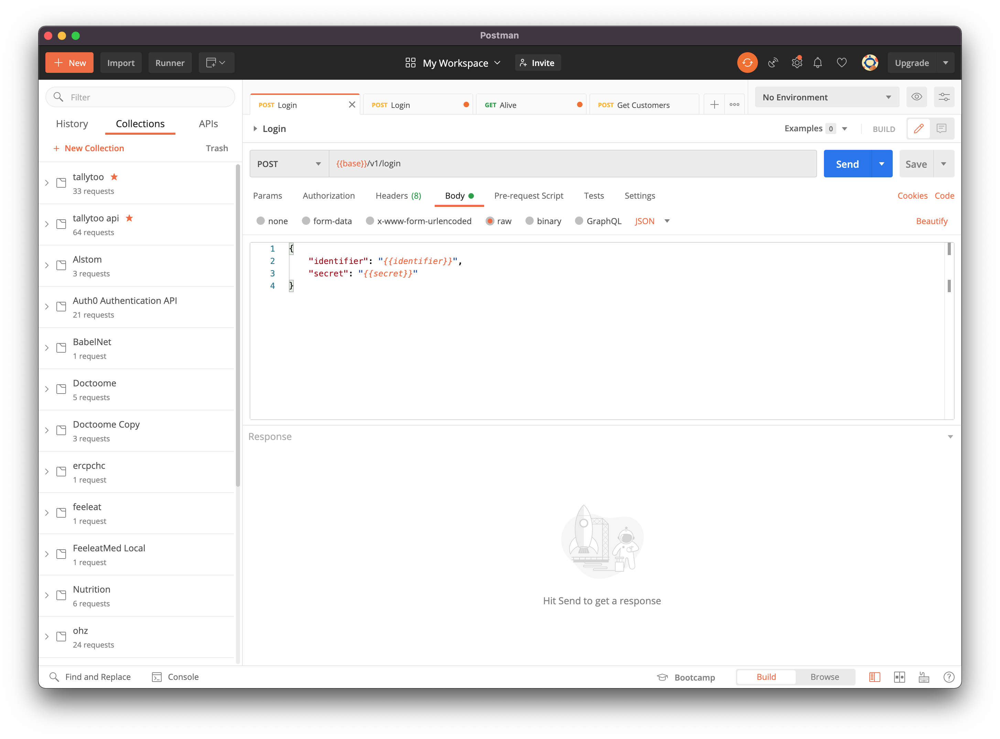

# Express

Express est une librairie simple, mais puissant pour la création d'un serveur avec NodeJS.

Personnellement j'aime beaucoup pour les raisons suivantes :

* Elle est **non-opinionated**, c'est-à-dire, je peux structurer comme je veux mes applications, sans avoir une structure imposée sur moi (comme Symfony etc). Ceci ouvre la possibilité d'erreurs, bien sûr, mais offre plus de flexibilité aussi.
* Elle supporte toutes les fonctions d'un serveur :
  * Serve des fichiers statics
  * Répond à toutes les requêtes HTTP
  * La gestion des formulaires
  * La gestion de multinoeud cluster
  * La gestion de sockets
  * ...
* Elle est entièrement configurable :
  * On peut ajouter des `middleware` où on veut pour paramétrer entièrement nos end-points.
  * Facilement préciser le format des réponses

## Inclure express

```sh
npm install express

# Installer aussi les définitions des types pour express
npm install @types/express
```

Selon la librairie, on devrait parfois installer les définitions Typescript de la libraire. La convention est le préfixe "@types/" avant le nom de la librairie.

De plus en plus de librairies incluent par défaut ses définitions dans la librairie de base, mais pas encore Express.

## Le serveur le plus simple

Voici un exemple d'un serveur extrêmement basique :

```ts
import Express, { NextFunction, Request, Response } from "express";
import { join } from 'path';

// Récupérer le port des variables d'environnement ou préciser une valeur par défaut
const PORT = process.env.PORT || 5050;

// Créer l'objet Express
const app = Express();

// Créer un endpoint GET
app.get('/helo', 
  (request: Request, response: Response, next: NextFunction) => {
    response.send("<h1>Hello world!</h1>");
  }
);

// Server des fichiers statiques
app.use('/public', Express.static(join('assets')));


// Lancer le serveur
app.listen(PORT,
  () => {
    console.info("API Listening on port " + PORT);
  }
);
```

J'ai créé une ligne dans `package.json` qui permet de lancer mon serveur avec `npm run server` :

```json
  ...
  "scripts": {
    ...
    "server": "nodemon --watch 'src' src/server.ts"
  },
  ...
```

En lançant le serveur, je peux donc ouvrir un navigateur aux liens suivants :

* [http://localhost:5050/helo](http://localhost:5050/helo)
* [http://localhost:5050/public/grunter.JPG](http://localhost:5050/public/grunter.JPG)

## Fondamentaux d'Express

Comment Express fonctionne ?

D'abord, Express écoute des connexions TCP entrantes (en réalité, Express n'est juste une enveloppe pour les fonctionnalités NodeJS qui aide à créer des Sockets, écouter sur des ports, etc).

Quand une nouvelle connexion est ouverte, la requête HTTP est interprétée pour ses différents composants :

* La **METHODE** demandé par HTTP, `get`, `put`, `post`, etc.
* Le **PATH**, ou le chemin indique dans l'URL (relatif au nom de demain ou adresse IP de votre serveur)

Express gère la requête via des _callbacks_. Avant de lancer le serveur, nous allons dire à Express quelles méthodes HTTP à implémenter sur quels chemins, en fournissant une fonction qui est censé gérer la requête.

Par exemple, le code suivant :

```ts
app.get('/helo', 
  (request: Request, response: Response, next: NextFunction) => {
    response.send("<h1>Hello world!</h1>");
  }
);
```

Ici, on précise que, pour une requête http de type `GET`, sur le chemin relatif `/helo`, il faut exécuter la fonction flèche que j'ai passée comme 2ème paramètre.

### Vocabulaire

On construit notre API en fournissant l'ensemble de callbacks sur les méthodes et les chemins.

Chaque combinaison de méthode/chemin est souvent appelé un **endpoint**, ou une **route**. Dans l'exemple, nous créons un API avec 4 **endpoints**. Notez que chaque endpoint est différent grâce à sa **méthode**, même si tous les 4 partagent le même chemin :


```
const app = Express();

app.get('/helo', (request: Request, response: Response, next: NextFunction) => {});
app.post('/helo', (request: Request, response: Response, next: NextFunction) => {});
app.put('/helo', (request: Request, response: Response, next: NextFunction) => {});
app.delete('/helo', (request: Request, response: Response, next: NextFunction) => {});
// ... etc.

```

Le deuxième paramètre est un **handler**, une fonction (ici exprimé en tant que fonction flèche) qui est appelée quand la requête arrive.

Express permet de préciser plusieurs **handlers** pour le même **endpoint** :

```ts
app.get('/helo', 
  (request: Request, response: Response, next: NextFunction) => {
    // 1. Ici, autoriser la requête
    next();
  },
  (request: Request, response: Response, next: NextFunction) => {
    // 2. Ici, exécuter d'autres fonctions
    next();
  },
  (request: Request, response: Response, next: NextFunction) => {
    // 3. Ici, renvoyer la réponse
    response.json({ result: "ok" });
  }
);
```

Dans l'exemple dessus, on précise 3 fonctions flèches à exécuter dans l'ordre pour le endpoint. Les fonctions intermédiaires s'appellent des **middleware**, car elles s'exécutent _au milieu_.

À noter : chaque **middleware** doit obligatoirement appeler la fonction `next()` qui est passé comme paramètre au callback. Cette fonction `next()` permet à Express de continuer avec la chaîne de middleware. L'idée est qu'on peut, par exemple, lancer un chargement long d'un fichier, et on ne continue pas avec les middlewares suivants, tant que le fichier n'est pas chargé en mémoire.

Appeler la fonction `next(error)` avec un paramètre non-nulle signale à Expresse qu'il y a eu une erreur. En effet, le paramètre contient l'information de l'erreur constatée. Expresse quitte la chaîne de middleware, et renvoie une réponse avec un code d'erreur.

Un **middleware** est intéressant dans la mesure où on peut réutiliser la même logique sur plusieurs endpoints. Par exemple, une fonction qui valide l'autorisation de l'utilisateur :

```ts
const authorise = (request: Request, response: Response, next: NextFunction) => {
  const authenticated = true; // Remplacez avec la vraie logique
  if (authenticated) {
    next()
  } else {
    response.statusCode = 403;
    next("User not authenticated");
  }  
};

app.get('/helo', 
  authorise,
  (request: Request, response: Response, next: NextFunction) => {
    // 2. Ici, exécuter d'autres fonctions
    next();
  },
  (request: Request, response: Response, next: NextFunction) => {
    // 3. Ici, renvoyer la réponse
    response.json({ result: "ok" });
  }
);

app.post('/user', 
  authorise,
  (request: Request, response: Response, next: NextFunction) => {
    // Ici, mettez à jour l'utilisateur
    // Ensuite, renvoyer une réponse
    response.json({ result: "ok" });
  }
);

```

Ici, on réutilise le même **middleware**, `authorise`, sur plusieurs **endpoints**.


Comme exercice, essayer les différents endpoints. Modifier l'autorisation afin de retourner une erreur (`authenticated = false`), et vérifier le comportement observé dans le navigateur.


### Paramètres des handlers

Chaque **handler** peut prendre plusieurs paramètres :

1. (facultatif) `error`: le message d'erreur. Si le **handler** a 4 paramètres, il serait utilisé dans le cas d'erreur (voir en bas).
2. `request` : un objet qui représente la requête HTTP, qui donne accès aux en-têtes (**header**), les paramètres **query** (dans l'URL), les paramètres extraits de l'URL (**params**), et les données du corps du message (**body**)
3. `response` : un objet qui représente la réponse qui sera renvoyée, ses en-têtes etc. Cet objet contient des fonctions qui permettent de renvoyer une réponse immédiate, gérer son format, gérer le code HTTP de la réponse, etc.
4. `next`: un callback à utiliser si on crée un **middleware**, c'est-à-dire une fonction qui traite la requête, mais qui ne va pas retourner une réponse. Il faut soit appeler `next()` pour signaler à Express de passer dans le prochain **handler**, soit `next(err)` pour signaler à Express qu'on a rencontré une erreur.

#### L'objet `Request`

Quand on gère une requête HTTP, souvent, on modifie le comportement selon les données passées avec la requête. Ces données peuvent arriver via différents chemins. Considérer la requête HTTP suivant :

```http
POST /user/67/profile?country=france HTTP/1.1
Host: developer.mozilla.org
Accept-Language: fr
Authorization: Bearer aabbccddee

{
  "name": "Kevin",
  "surname": "Glass"
}
```

Cette requête sera gérée par le endpoint suivant :

```ts
app.post('/user/:userId/profile', 
  authorise,
  (request: Request, response: Response, next: NextFunction) => {

    const authorisation = request.headers.authorization;
    const userId = request.params.userId;
    const country = request.query.country;    
    const data = request.body;

    // Ici, mettez à jour l'utilisateur

    // Ensuite, renvoyer une réponse
    response.json({ result: "ok" });
  }
);
```

Ici, on envoie une requête de type `POST` au chemin `/user/:userId/profile`. Avec cette requête il y a d'autres informations :

* Des **URL parameters**, notamment des morceaux du chemin identifiés par des deux-points. Dans notre cas, c'est le `:userId`. En effet, ce morceau de chemin peut être dynamique, et par exemple, précise un identifiant unique pour notre utilisateur. C'est ainsi qu'on construit des URLs uniques pour chaque **ressource** de notre API Rest. On accède à ces valeurs via le `params` objet sur le `Request`.
* Des **query parameters**, spécifiquement ceux qui se trouvent après le point d'interrogation sur le chemin. Dans l'exemple, on précise `country=france`, et on récupère ces valeurs via le `query` objet sur le `Request`
* Le **body** ou le corps du message. Ce sont les données envoyées après la ligne blanche qui suit les en-têtes. Le body peut être en forme de JSON, un formulaire, ou bien juste des données binaires.
* Les en-têtes, ou **headers**. On peut les récupérer via l'objet `requet.headers`

Attention ! Les différents types de méthode HTTP supportent (ou pas) la présence d'un corps de message :

<table><thead><tr><th width="133">Méthode</th><th width="105">Headers</th><th width="100">Params</th><th width="156">Query Params</th><th>Body</th></tr></thead><tbody><tr><td>GET</td><td><span data-gb-custom-inline data-tag="emoji" data-code="2705">✅</span></td><td><span data-gb-custom-inline data-tag="emoji" data-code="2705">✅</span></td><td><span data-gb-custom-inline data-tag="emoji" data-code="2705">✅</span></td><td><span data-gb-custom-inline data-tag="emoji" data-code="274c">❌</span></td></tr><tr><td>PUT</td><td><span data-gb-custom-inline data-tag="emoji" data-code="2705">✅</span></td><td><span data-gb-custom-inline data-tag="emoji" data-code="2705">✅</span></td><td><span data-gb-custom-inline data-tag="emoji" data-code="2705">✅</span></td><td><span data-gb-custom-inline data-tag="emoji" data-code="2705">✅</span></td></tr><tr><td>POST</td><td><span data-gb-custom-inline data-tag="emoji" data-code="2705">✅</span></td><td><span data-gb-custom-inline data-tag="emoji" data-code="2705">✅</span></td><td><span data-gb-custom-inline data-tag="emoji" data-code="2705">✅</span></td><td><span data-gb-custom-inline data-tag="emoji" data-code="2705">✅</span></td></tr><tr><td>DELETE</td><td><span data-gb-custom-inline data-tag="emoji" data-code="2705">✅</span></td><td><span data-gb-custom-inline data-tag="emoji" data-code="2705">✅</span></td><td><span data-gb-custom-inline data-tag="emoji" data-code="2705">✅</span></td><td><span data-gb-custom-inline data-tag="emoji" data-code="274c">❌</span></td></tr></tbody></table>

### Exemple

Le suivant est un exemple d'un mini API qui rassemble tous les éléments présentés ci-dessus.


```ts
import Express, { NextFunction, Request, Response } from "express";
import { json } from "body-parser";

// Récupérer le port des variables d'environnement ou préciser une valeur par défaut
const PORT = process.env.PORT || 5050;

// Créer l'objet Express
const app = Express();


const loadUserStub = async (userId: string) => {
  // ex. "select userId from users where id = userId"
  return undefined;
}

const updateUserStub = async (userId: string, params: any) => {
  // ex. "update users set ...."
  return undefined;
}

// L'appli parse le corps du message entrant comme du json
app.use(json());

// Créer un endpoint POST
// On signal un paramètre qui existe dans le URL (:userId) avec un deux-point
app.post('/user/:userId/update', 
  
  // MIDDLEWARE 1 : Authorisation
  // A noter, dans express, les middlewares peuvent être async
  async (request: Request, response: Response, next: NextFunction) => {

    try {
      // Les query PARAMS sont disponibles sur l'objet request
      const userId = request.params.userId;
      if (!userId /* || user not in database */) {
        throw new Error("UserId not found!");
      }

      // ICI, valider l'autorisation
      response.locals.user = await loadUserStub(userId);

      // Si tout va bien, on appelle next() pour passer à l'étape 2
      next();

    } catch (err: any) {
      next(err);
    }
  },

  // MIDDLEWARE 2 : 
  async (request: Request, response: Response, next: NextFunction) => {
    
    try {
      // Mettre à jour les données
      await updateUserStub(response.locals.user, request.body);

      next();
    } catch (err: any) {
      next(err);
    }

  },

  // HANDLER FINAL : 
  async (request: Request, response: Response, next: NextFunction) => {
    response.json({
      id: response.locals.userId,
      ok: "true",
      debug:  {
        headers: request.headers,
        body: request.body,
        params: request.params,
        query: request.query
      }
    });
  },

);


// Lancer le serveur
app.listen(PORT,
  () => {
    console.info("API Listening on port " + PORT);
  }
);

```


Prenez note de :

* La possibilité d'enchaîner les **middleware**
* L'utilisation de la fonction `json` de la fonction `body-parser`, utilisé comme **middleware** global (avec `app.use(...)`). Ce middleware sert à parser automatiquement le corps de messages en tant que JSON.
* La possibilité d'utiliser les middleware `async`
* La pattern try/catch avec la fonction `next()`
* L'utilisation des différentes valeurs dans `request`, comme `params`, `query`, etc.

## Tester les endpoints

Il est possible d'utiliser des outils comme `curl` pour tester votre endpoint :

```
curl -X POST localhost:5050/user/1234/update 
```

En général, je préfère utiliser [Postman](https://www.postman.com/downloads/) :

<figure><figcaption></figcaption></figure>

Cet outil permet de configurer et tester vos endpoints.



**Exercice**

Téléchargez Postman et configurez un test pour le endpoint `/user/:userId/update`.

* Observez les headers
* Essayez d'envoyer des paramètres **query** (dans l'url, après le `?`)
* Essayez d'envoyer du json dans le **body**
* Essayer à ne pas passer un paramètre `:userId`


## Exercice

Créez un nouveau projet "from-scratch", en essayant de tester vos compétences en dev-containers, nodejs, typescript, expressjs, etc.

Il faut créer un serveur calculatrice avec les endpoints suivants :

```
# Calculez la factorielle de 8
GET /calc/factorial?val=8  

# Accepter une body avec 2 valeurs : p et n, pour calculer la combinaison (https://www.123calculus.com/combinaison-page-1-16-140.html)
POST /calc/combinaison

# Calculer l'hypotenuse en utilisant Pythagore, en passant le x et y uniquement par les headers... est-ce possible ?
DELETE /calc/hypot 


```

## Router

Il est possible de créer aussi des `Router`, un objet qui regroupe un set de routes, qu'on peut attacher comme middleware à l'arborescence :

```ts

// Définir un router qui représente une sous-branche de notre hiérarchie :
const router = Router({ mergeParams: true });

router.get('/',
  async (request: Request, response: Response, next: NextFunction) => {
    /// ...
  }
);

router.post('/:userId',
  async (request: Request, response: Response, next: NextFunction) => {
    /// ...
  }
);

/// ....

/// Ensuite, on peut attacher la sous-branche où on veut, ici sous /user
app.use('/user', router);

/* Les endpoints suivants vont désormais être disponibles :
GET /user
POST /user/:userId
*/
```

Dans l'exemple, on attache un router qui commence à gérer les opérations CRUD au chemin `/user`. On commence à voir qu'il serait possible (avec un peu d'intelligence) de créer un set générique de **handler** pour gérer les opérations CRUD, et les attacher aux différents points dans la hiérarchie.

### Exemple avec Router

Nous aimerions séparer nos différentes routes en fichiers différents.

D'abord, on va créer une sous-branche de notre API qui gère l'utilisateur.


```ts
import { NextFunction, Request, Response, Router} from "express";
import { authorizeUser } from './authorize-user.middleware';


// Index des utilisateurs

const routerIndex = Router({ mergeParams: true });

routerIndex.get('/',
  async (request: Request, response: Response, next: NextFunction) => {
    // Retourner une liste d'utilisateurs, avec pagination par exemple
    response.json({ 
      type: 'index',
      query: request.query
    });
  }
);

// Affichage / Manipulation d'un utilisateur

const routerSimple = Router({ mergeParams: true });

// Peut-être sous /:userId il faut passer un middleware d'autorisation avant de manipuler les données
routerSimple.use(authorizeUser());

routerSimple.get('/', 
  async (request: Request, response: Response, next: NextFunction) => {
    // Retourner la fiche utilisateur pour :userId

    response.json({ 
      type: 'get',
      params: request.params,
      query: request.query,      
    });
  }
)

routerSimple.put('/', 
  async (request: Request, response: Response, next: NextFunction) => {

    // Mettre à jour la fiche utilisateur pour :userId
    
    response.json({ 
      type: 'put',
      params: request.params,
      query: request.query,      
      body: request.body
    });
  }
);

routerSimple.delete('/', 
  async (request: Request, response: Response, next: NextFunction) => {

    // Supprimer
    
    response.json({ 
      type: 'put',
      params: request.params,
      query: request.query,      
    });
  }
)


// Regroupé

const routerUser = Router({ mergeParams: true });
routerUser.use(routerIndex);
routerUser.use('/:userId', routerSimple);

export const ROUTES_USER = routerUser;

```


Ensuite, on peut assembler notre API :


```ts
import Express, { json } from "express";
import { ROUTES_USER } from './middleware/user';

// Récupérer le port des variables d'environnement ou préciser une valeur par défaut
const PORT = process.env.PORT || 5050;

// Créer l'objet Express
const app = Express();

// L'appli parse le corps du message entrant comme du json
app.use(json());

// Accrocher les routes CRUD de l'utilisateur à la hierarchie
app.use('/user', ROUTES_USER);

// Lancer le serveur
app.listen(PORT,
  () => {
    console.info("API Listening on port " + PORT);
  }
);
```


À noter :

* On peut utiliser le mot clé `export` d'un fichier typescript afin de le rendre accessible de l’extérieur du fichier, et l'inclure dans un autre fichier.
* Le fichier qui concerne les endpoints de l'User est agnostique à sa position dans l'arborescence. On l'attache avec `app.use()` en construisant notre API.

