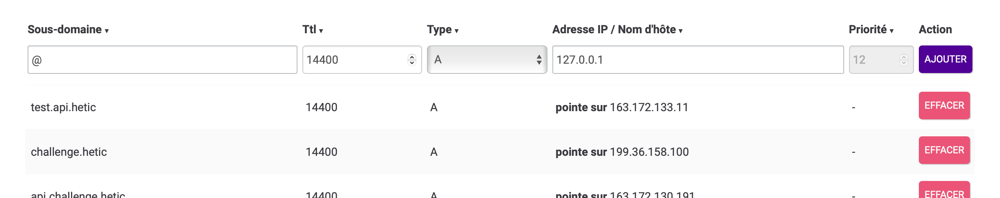

# Connexion HTTPS

La plupart des navigateurs aujourd'hui exigent, en dehors d'un environnement de développement (sur `localhost`), une connexion sécurisée par SSL (https).

Nous allons sécuriser notre API en utilisant un **reverse proxy** :

- On utilise un logiciel de serveur web (ex. nginx ou apache) qui fait déjà très bien la tache de gérer des connexions https. Ce serveur va accepter des connexions entrantes sur le protocole https (normalement le port 443), les déchiffrer, et les rediriger vers notre API.
- Notre API NodeJS va écouter sur un port sur notre réseau interne (pas accessible au public). Il accepte les connexions de notre serveur Apache.


> Vous trouverez le projet fonctionnel de ce chapitre [ici](https://dev.glassworks.tech/courses/api/api-code-samples/-/tree/004-https)

## Un reverse proxy en local

Commençons par tester l'utilisation de nginx et cette notion de reverse-proxy en local.

Nous allons utiliser nginx pour notre exemple, en l'ajoutant à notre `docker-compose.dev.yml` :

```yml
  ...
  proxy:
    image: nginx
    ports:
      - "80:80"
      - "443:443"
    restart: always
    volumes:
      - ./nginx/api-dev.nginx.conf:/etc/nginx/conf.d/api.nginx.conf
    networks:
      - api-network
```

On ouvre des ports 80 (http) et 443 (https), et on monte un fichier de configuration de nginx qui se trouvera dans notre projet sous `nginx/api-dev.nginx.conf` :


```conf
server {
    listen 80;
    server_name test.api.hetic.glassworks.tech;

    location / {
       proxy_pass http://vscode_api:5050;
    }
}
```

Cette configuration est la plus simple possible pour un reverse proxy sur nginx. Nous précisons le port d'écoute et le nom d'hôte du serveur.

Ensuite on précise un ou plusieurs `location`, un chemin (URL) local, qui doit être traité par nginx. Ici, on précise que toutes les requêtes entrantes sur le chemin `/`  (donc toutes les requêtes) doivent être redirigées vers notre api, sur le port 5050. 

Notez l'utilisation du nom d'hôte `vscode_api`, qui est le nom du service dans notre Dev Container. Docker est capable de convertir ce nom en adresse IP.

Redémarrer votre Dev Container (F1, puis reconstruire le container).

Si tout se passe bien, vous pourriez modifier votre Postman, en utilisant plutôt le port 80 (ou en enlevant complètement le port). La requête passera d'abord par nginx avant d'être redirigé vers notre API.

## Critères d'une connexion SSL

Afin d'établir une connexion SSL, il nous faudrait un certificat SSL qui nous identifie, et un tiers qui va valider notre identité (comme discuté en classe lors de notre cours sur Unix SHELL).

Certains services payants pourraient nous fournir ce certificat (gandi, thawte, verisign, etc.), après avoir validé notre identité.

Une solution gratuite existe qui s'appelle `certbot`. L'idée est le suivant :

- nous mettons en place un serveur web
- nous faisons pointer une entrée DNS vers notre serveur
- le fait de pouvoir configurer le DNS prouve notre identité
- certbot lance une procédure de validation :
  - un secret est mis à disposition sur notre serveur
  - les serveurs de certbot essaye de récupérer le secret en utilisant notre nom d'hôte saisie dur le DNS
  - si certbot arrive à le faire, cela prouve qu'on est admin de le DNS et admin du serveur. Certbot en a assez pour nous créer et valider un certificat


Afin d'utiliser certbot alors, on a besoin de plusieurs ingrédients :

- un serveur fonctionnel et accessible sur Internet
- un nom de domaine configuré (payant)
  
### Un serveur

Pour cela, je vais utiliser une instance louée sur Scaleway.

Je commence par utiliser un simple `docker-compose.stage.setup.yml`, une configuration temporaire qui lance un serveur nginx, et qui contient le service certbot aussi :


```yml
version: '3.9'

services: 
  proxy:
    image: nginx
    ports:
      - "80:80"
      - "443:443"
    restart: always
    volumes:
      - ./nginx/api-https-setup.nginx.conf:/etc/nginx/conf.d/api.nginx.conf
      - ./nginx/certbot/www:/var/www/certbot/:ro
      - ./nginx/certbot/conf/:/etc/nginx/ssl/:ro
    networks:
      - api-network

  certbot:
    image: certbot/certbot:latest
    volumes:
      - ./nginx/certbot/www/:/var/www/certbot/:rw
      - ./nginx/certbot/conf/:/etc/letsencrypt/:rw
    networks:
      - api-network

networks:
  api-network:
    driver: bridge
    name: api-network
```

Notez qu'on utilise une configuration différente de nginx cette fois-ci, à `nginx/api-https-setup.nginx.conf` :


```conf
server {
    listen 80;
    listen [::]:80;

    server_name test.api.hetic.glassworks.tech;
    server_tokens off;

    location /.well-known/acme-challenge/ {
        root /var/www/certbot;
    }
    
    location / {
        return 301 https://test.api.hetic.glassworks.tech$request_uri;
    }

}
```

Le nom de serveur, `server_name`, doit être le même nom qu'on va configurer chez notre fournisseur de DNS. À voir dans quelques instants.

On crée une `location` utilisé par certbot (`/.well-known/acme-challenge`) pour servir le secret qu'il va créer pour tester notre domaine.

Notez donc, qu'on a créé quelques volumes pour le partage des fichiers de configuration et secrets entre nginx et certbot:
- `./nginx/certbot/www` : certbot va créer le secret dans ce dossier, et nginx va servir ce secret à la demande des serveurs certbot
- `./nginx/certbot/conf/` : après la validation, certbot va créer et sauvegarder nos certificats à cet emplacement

Nous allons copier cette configuration sur notre instance accessible sur Internet.

Après avoir installé Docker (si pas encore fait), on lance la configuration :

```bash
docker compose -f docker-compose.stage.setup.yml up -d
```

Le serveur nginx se lance, et écoute sur le port 80.


### Un nom de domaine

Cette partie est malheureusement payante, vous pouvez le faire si vous avez déjà un nom de domaine. N'importe quel fournisseur des services web est capable d'en commander pour vous (OVH, Scaleway, Gandi, ... )

Vous accédez à la configuration de la **zone DNS**, et vous ajoutez une ligne de type `A` qui point vers votre instance :

<figure><figcaption></figcaption></figure>


### Création des certificats

Nous avons tous ce qu'il faut pour lancer la procédure de création de certificats par certbot. Nous allons lancer ponctuellement le service `certbot`  de notre configuration `docker-compose.stage.setup.yml`, en le demandant de configurer notre nom de domaine (ici `test.api.hetic.glassworks.tech`) :

```bash
docker compose -f docker-compose.stage.setup.yml run --rm  certbot certonly --webroot --webroot-path /var/www/certbot/ -d test.api.hetic.glassworks.tech
```

On répond à toutes les questions, et si tout va bien, on termine avec des certificats dans `./nginx/certbot/conf/`.

Super ! Maintenant, on va arrêter notre environnement temporaire, et réutiliser ces certificats dans notre environnement de production.

```bash
docker compose -f docker-compose.stage.setup.yml down
```

## Environnement de production

Nous n'avons pas encore parlé du déploiement de notre API. Aujourd'hui, on n'a qu'un environnement de développement, dans lequel on lance notre API manuellement.

On va s'occuper d'un **build** de notre API et son lancement comme un service dans notre `docker-compose.stage.yml`.

### Transpilation

Nous aimerions construire une version finale de notre API, déjà transpilée en JS, et avec le minimum de dépendances nécessaires pour exécuter.

Pour cela, nous allons ajouter quelques lignes dans notre `package.json` :

```json
   "scripts" : {
       ...
      "clean": "rimraf build",
      "build": "npm run clean && tsc",
      "start-api": "node ./build/server.js"
   }
```

La commande `tsc` effectue définitivement le build de notre API, et enregistre les fichiers en .js pur dans le dossier `./build` (cet emplacement est précisé dans `tsconfig.json`).

Le script `clean` vide cet emplacement, pour être certain qu'on a un build propre à chaque fois. Il dépend d'une petite librairie `rimraf` qu'il faut installer avec :

```bash
npm install rimraf --save-dev
```

Le script `start-api` sera utilisé après le build, et lancera le javascript résultant du build. Vous remarquerez que l'API commence plus vite avec cette commande (après le build) car la transpilation de Typescript a déjà été faite.

Essayez ces 3 scripts - tout devrait fonctionner en local !

### Construire une image Docker

Ensuite, nous allons créer une image Docker qui permet d'être lancé comme un service. Pour cela, on aura un fichier  `docker/Dockerfile.stage` :

```Dockerfile
FROM node:18-alpine AS api-builder
WORKDIR app
COPY . .
RUN npm install
RUN npm run clean
RUN npm run build

FROM node:18-alpine AS api
WORKDIR app
COPY --from=api-builder /app/build ./build
COPY package* ./
RUN npm install --omit=dev
CMD npm run start-api
```

Ce Dockerfile contient les instructions de build d'une image Docker. Il se compose de deux étapes. Une première étape crée une image dans lequel on fait notre transpilation. Notez qu'on exécute les commandes `clean`  et `run` dans cette phase.

Dans la deuxième phase on copie simplement l'artéfact de build de l'étape précédent (le dossier `build`) dans une nouvelle image, et on n'installe que les dépendances nécessaires pour l'exécution (`npm install --omit-dev`).

### Environnement de production

Nous sommes prêts maintenant à créer un `docker-compose.stage.yml` qui lance notre SGBDR, notre API (déjà construit), notre serveur nginx, et certbot.

```yml
version: '3.9'

services:
  api:
    build: 
      context: ./
      dockerfile: ./docker/Dockerfile.stage
    container_name: api
    ports:
      - "5050:5050"
    environment:
      - NODE_ENV=prod
      - PORT=5050      
    networks:
      - api-network
    restart: always
    logging:
      driver: "json-file"
      options:
        max-file: "5"
        max-size: "500m"
    
  dbms:
    image: mariadb
    restart: always
    ports:
      - "3309:3306"
    environment: 
      - MYSQL_ALLOW_EMPTY_PASSWORD=false
      - MYSQL_ROOT_PASSWORD=rootpassword
    command: [
      "--character-set-server=utf8mb4",
      "--collation-server=utf8mb4_unicode_ci",
    ]
    volumes:
      - ./dbms/dbms-data:/var/lib/mysql
      - ./dbms/mariadb.cnf:/etc/mysql/mariadb.cnf
    networks:
      - api-network

  proxy:
    image: nginx
    ports:
      - "80:80"
      - "443:443"
    restart: always
    volumes:
      - ./nginx/api-https-final.nginx.conf:/etc/nginx/conf.d/api.nginx.conf
      - ./nginx/certbot/www:/var/www/certbot/:ro
      - ./nginx/certbot/conf/:/etc/nginx/ssl/:ro
    networks:
      - api-network

  certbot:
    image: certbot/certbot:latest
    volumes:
      - ./nginx/certbot/www/:/var/www/certbot/:rw
      - ./nginx/certbot/conf/:/etc/letsencrypt/:rw
    networks:
      - api-network

networks:
  api-network:
    driver: bridge
    name: api-network

```

Notez le suivant :

- pour le service `api`, on a précisé le `Dockerfile.stage` qu'on a créé dans l'étape précédente
- pour le service `nginx` et `certbot`, on a précisé les mêmes emplacements que dans l'étape de configuration de nos certificats

Enfin, la configuration de nginx a changé aussi, car maintenant, on écoute sur le port 443 et on utilise des certificats :

```conf
server {
    listen 80;
    listen [::]:80;

    server_name test.api.hetic.glassworks.tech;
    server_tokens off;

    location /.well-known/acme-challenge/ {
        root /var/www/certbot;
    }
    
    location / {
        return 301 https://test.api.hetic.glassworks.tech$request_uri;
    }
}


server {
    listen 443 default_server ssl http2;
    listen [::]:443 ssl http2;

    server_name test.api.hetic.glassworks.tech;

    ssl_certificate /etc/nginx/ssl/live/test.api.hetic.glassworks.tech/fullchain.pem;
    ssl_certificate_key /etc/nginx/ssl/live/test.api.hetic.glassworks.tech/privkey.pem;

    location / {
       proxy_pass http://api:5050;
    }     
}
```

Maintenant, on a deux serveurs :

- un serveur http (80) qui sert uniquement à rediriger (via un code 301) la requête vers le port 443
- le serveur https (443) qui utilise les certificats pour établir une connexion https, et redirige les requêtes vers notre API.

On est prêt à lancer notre environnement sur notre instance :

```bash
docker compose -f docker-compose.stage.yml up -d
```

Tester avec Postman maintenant, en utilisant plutôt votre nom d'hôte, par exemple :

```http
GET https://test.api.hetic.glassworks.tech/user
```



Vous aurez probablement une erreur du fait que votre API n'a pas le droit d'accéder à la base de données. C'est normal, car ici, on n'a pas parlé de l'initialisation de la base en production.

Ce qui compte, est qu'on a réussi à contacter notre API via https !



## Renouvellement des certificats

Un certificat certbot expire après 3 mois. Il est facile de renouveler les certificats via notre configuration avec :

```bash
docker compose -f docker-compose.stage.yml run --rm certbot renew
```

On pourrait, par exemple, créer une ligne dans le CRON pour le faire régulièrement.
