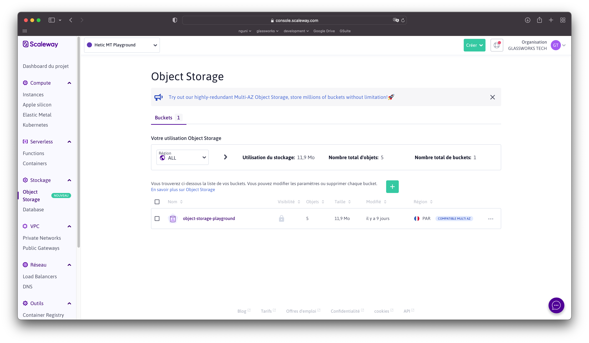
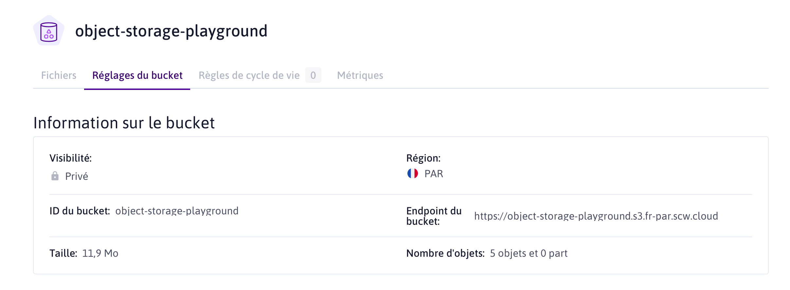

# Fichiers

Dans un déploiement cloud on ne pourrait pas stocker des fichiers des utilisateurs localement (comme dans WordPress ou autre type de serveur) :

* Pour un **scaling horizontal** On aimerait pouvoir dupliquer des processus de notre api plusieurs fois, sur plusieurs instances dans plusieurs pays
* Il faut donc un point centralisé et partagé de stockage

Amazon a eu énormément de succès avec leur protocole S3 pour le stockage "d'objets" dans le cloud. Aujourd'hui la plupart des fournisseurs cloud offre un service de stockage qui s'appelle "Object Storage", qui respecte la norme Amazon S3.

Le principe est qu'on stocke un "objet" (un fichier) sous un chemin textuel, mais on n'a aucun détail concernant l'emplacement disque etc. Il y a un protocole HTTP qui permet d'envoyer des objets, récupérer des objets, les supprimer ou les interroger (pour de la meta-data).

> Vous trouverez le projet fonctionnel de ce chapitre [ici](https://dev.glassworks.tech:18081/courses/api/api-code-samples/-/tree/006-files)

## Buckets chez Scaleway

Chez Scaleway, il y a ce service :

<figure><figcaption></figcaption></figure>

Mais on trouve aussi les Object Storage chez Google, AWS (bien sur), OVH, etc.

On commence par créer un `bucket`, un seau dans lequel on va stocker nos fichiers. Une fois crée, il y a des informations qu'on va utiliser dans notre API pour communiquer avec le bucket :

<figure><figcaption></figcaption></figure>

## Identification

Il est possible d'avoir des buckets ouvert au public, ou privé :

* Ouvert au public : pour les blogs etc où on va juste références les images, fichiers etc dans notre html avec ``. Il n'y a pas de sécurité.
* Privé : on va exiger de la sécurité avant de récupérer les fichiers.

Pour un usage privé, il faut disposer des clés d'accès. Créer des clés d'accès change selon le fournisseur cloud, mais chez Scaleway on va dans Organisation (en haut à droite), Identifiants, Clés API. Ensuite, on clique sur "Générer une nouvelle clé API".

Attention : le code secret s'affiche qu'une seule fois donc, prenez note ! À tout moment, si on constate de l'abus sur la clé, on peut la supprimer et remplacer avec une nouvelle.

## Relier notre base et le stockage

Chez nous, on va probablement devoir garder une trace de fichiers stockés dans le cloud. De la même manière que l'on stocke, par exemple, le chemin absolut (ou relative) d'un fichier sur le stockage local, on va stocker le chemin pour retrouver le fichier sur le cloud.

Heureusement avec Object Storage chaque fichier est identifié par un chemin qui est très similaire à un chemin pour un fichier :

```
https://object-storage-playground.s3.fr-par.scw.cloud/user/15/0e822c95-4d7e-4dd9-ac9f-5e19c6860b25/Crumpets.JPG

# Chemin vers le bucket : https://object-storage-playground.s3.fr-par.scw.cloud
# Chemin local du fichier : user/15/0e822c95-4d7e-4dd9-ac9f-5e19c6860b25/Crumpets.JPG
```

Nous allons donc stocker cet identifiant dans notre base de données.

Par exemple, j'aimerais permettre à un utilisateur de mon API de télécharger des fichiers liées à son compte. Je vais ajouter une table suivante à mon DDL :

```sql
/* La définition de la schéma */
use school;

/* user */
create table if not exists user (
  userId int auto_increment not null,
  email varchar(256) unique not null, 
  familyName varchar(256), 
  givenName varchar(256), 
  primary key(userId)
);

drop trigger if exists before_insert_user;

create trigger before_insert_user
before insert
on user for each row set new.email = lower(trim(new.email));

/* Fichier d'un utilisateur */
create table if not exists user_file (
  fileId int auto_increment not null,
  userId int not null,
  storageKey varchar(512) not null,
  filename varchar(256),
  mimeType varchar(256),
  primary key(fileId),
  foreign key(userId) references user(userId) on delete cascade
);
```

J'appelle l'ID du fichier dans le cloud `storageKey`

Pour mettre à jour ma base de données, je fais :

```
mycli -h dbms -u root school < ./dbms/ddl/ddl.sql 
```

Dans notre API, nous allons préciser à Typescript l'existence de cette nouvelle table. Dans `src/model/DbTable.ts` :

```ts
export type DbTable = 
  'user' |
  'user_file'
;
```

Et dans `src/model/User/IUserFile.ts` :

```ts
export interface IUserFile {
  fileId: number;
  userId: number;
  storageKey: string;
  filename?: string;
  mimeType?: string;
}

export type IUserFileCreate = Omit<IUserFile, 'fileId'>;
export type IUserFileUpdate = Partial<IUserFileCreate>;
export type IUserFileRO = Readonly<IUserFile>;
```

## Outil pour parler avec l'Object Storage

Amazon maintient un package NodeJS pour le protocole S3 :

```sh
npm install @aws-sdk/client-s3
```

Dans notre projet, on crée un outil (**wrapper**) qui permet d'envoyer et récupérer des fichiers de notre bucket S3:

```ts
import { GetObjectCommandInput, PutObjectCommandInput, S3 } from "@aws-sdk/client-s3";

import { Readable } from 'stream';
import { ApiError } from "./Error/ApiError";
import { ErrorCode } from "./Error/ErrorCode";

process.env.AWS_ACCESS_KEY_ID = process.env.AWS_ACCESS_KEY_ID || "SCWTY6B680E3QQ9WM2V5";
process.env.AWS_SECRET_ACCESS_KEY = process.env.AWS_SECRET_ACCESS_KEY || "18856bfe-8260-4cfd-8802-389f943deccf";

const REGION = process.env.STORAGE_REGION || "fr-par";
const ENDPOINT = process.env.STORAGE_ENDPOINT || "https://s3.fr-par.scw.cloud";
const BUCKET = process.env.STORAGE_BUCKET || "object-storage-playground";

/**
 * Classe wrapper pour un service de stockage d'objet cloud. Cette classe utilise le protocole Amazon S3, mais
 * on pourrait le remplacer avec un autre service (exemple Firebase) si on veux.
 * @todo Pour l'instant on envoie et récupère des fichiers. Idéalement on complétera avec d'autre fonctions comme: lister les fichiers, récupérer juste le meta-data des fichiers, tester l'existence d'un fichier, etc.
 */
export class ObjectStorage {
  
  static async upload(buffer: Buffer, key: string, mimetype?: string): Promise<string> {
    const bareBonesS3 = new S3({
      region: REGION,
      endpoint: ENDPOINT           
    });


    const uploadParams: PutObjectCommandInput = {
      Bucket: BUCKET,
      ACL: "public-read",
      Key: key,
      Body: buffer,
      ContentType: mimetype
    }

    const result = await bareBonesS3.putObject(uploadParams);

    if (result.$metadata.httpStatusCode !== 200) {
      throw new ApiError(ErrorCode.InternalError, 'object/invalid-multipart', "Error transmitting file to object storage", result);
    }

    return key;
  }

  static async download(key: string): Promise<Readable> {

    const bareBonesS3 = new S3({
      region: REGION,
      endpoint: ENDPOINT
    });

    const downloadParams: GetObjectCommandInput = {
      Bucket: BUCKET,
      Key: key 
    }

    const result = await bareBonesS3.getObject(downloadParams);
    return result.Body as Readable;

  }

}
```

Cette classe simplifie la donne :

* On la donne un tampon mémoire avec les données d'un fichier, avec l'ID et son type, et on laisse la classe s'occuper de l'envoi vers le Bucket
* On la donne une ID de stockage, et on laisse la classe récupérer l'objet, en retournant un **stream** qui sera rempli de données du fichier.

Notez ici, que les coordonnées de connexion au Bucket sont inclus dans la classe directement, mais modifiables par des variables d'environnement. Idéalement on utilisera un autre Bucket pour la production !!

## Préciser des endpoints

On va se servir de cet outil pour uploader et downloader des fichiers pour notre utilisateur, en créant 2 endpoints :

* `POST /user/:userId/file` : pour uploader un fichier
* `GET /user/:userId/file/:fileId` : pour downloader un fichier

Je crée le controller dans `src/routes/UserFileController.ts`

```ts
import { NoSuchKey } from '@aws-sdk/client-s3';
import express from "express";
import multer from "multer";
import { Get, Middlewares, Path, Post, Query, Request, Route, Security, SuccessResponse } from 'tsoa';
import { v4 } from 'uuid';
import { IUserFile, IUserFileCreate } from '../model/User/IUserFile';
import { ICreateResponse } from '../types/ICreateResponse';
import { IIndexResponse } from '../types/IIndexQuery';
import { Crud } from '../utility/Crud';
import { ApiError } from '../utility/Error/ApiError';
import { ErrorCode } from '../utility/Error/ErrorCode';
import { ObjectStorage } from '../utility/ObjectStorage';

/**
 * Controller pour le téléchargement des fichiers concernant un utilisateur
 */
@Route("/user/{userId}/file")
export class UserFileController {

  /**
   * Envoyer un fichier
   * @param userId Le ID de l'utilisateur
   */
  @Post()
  @Middlewares(multer().single("file"))
  public async uploadFile(@Path() userId: number, @Request() request: express.Request): Promise<ICreateResponse> {
    
    if (!request.file) {
      throw new ApiError(ErrorCode.BadRequest, 'object/invalid-multipart', 'Missing file data in multi-part upload');
    }

    const filename = (request.file.filename || request.file.originalname || v4());
    const storageKey =  `user/${userId}/${filename}`;

    await ObjectStorage.upload(
      request.file.buffer,
      storageKey,
      request.file.mimetype,          
    )

    const result = await Crud.Create<IUserFileCreate>({
      userId,
      storageKey,
      filename,
      mimeType: request.file.mimetype
    }, 'user_file');

    return result;
  } 

  /**
   * Récupérer une liste de fichiers d'un utilisateur
   */
  @Get()
  public async showFiles(
    @Path() userId: number,
    /** La page (zéro-index) à récupérer */
    @Query() page?: string,    
    /** Le nombre d'éléments à récupérer (max 50) */
    @Query() limit?: string,    
  ): Promise<IIndexResponse<IUserFile>> {
    return Crud.Index<IUserFile>({ page, limit }, 'user_file', ['fileId', 'userId', 'storageKey', 'mimeType'], { userId });
  }

  /**
   * Récupérer un fichier selon son ID. Le résultat est une série de messages (statut 200) contenant les contenus du fichier.
   */
  @Get("{fileId}")
  @SuccessResponse("200", "Chunked object stream") // Custom success response
  public async downloadFile(@Path() fileId: number, @Request() request: express.Request) {
    
    const response = request.res;
    if (!response) {
      throw new ApiError(ErrorCode.InternalError, 'object/invalid-response', "A response object was not available")
    }

    // D'abord, récupérer la ligne dans la table, afin de récupérer la clé du stockage objet
    const file = await Crud.Read<IUserFile>(
      'user_file',
      'fileId',
      fileId,
      ['fileId', 'storageKey', 'mimeType']
    );
     
    // Ensuite lancer et streamer la réponse
    await new Promise<void>(
      async (resolve, reject) => {
        try {
          const stream = await ObjectStorage.download(file.storageKey);
          request.res!.writeHead(200, {
            'Content-Type': file.mimeType || 'application/octet-stream',
            'Transfer-Encoding': 'chunked'
          });
          stream.on('data', (chunk) => { response.write(chunk); });
          stream.on('error', (err) => {
            throw(err);
          });
          stream.on('end', () => {
            response.end();
            resolve();
          })

        } catch (err) {
          if (err instanceof NoSuchKey) {
            reject(new ApiError(ErrorCode.InternalError, 'object/key-not-found-in-storage', 'Key not found in storage', { key: file.storageKey }));
          } else {
            reject(err)
          }          
        }
      }
    )
  }
}
```

Ce fichier dépend de deux librairies supplémentaires :

```bask
# Pour nous aider à recevoir des requêtes de type **mult-part** contenant des fichiers
npm install multer

# Pour la génération des UUIDs
npm install uuid
npm install @types/uuid --save-dev
```


Pour faciliter l'exemple, on n'a pas sécurisé les routes. Dans une vraie production, normalement, ces routes doivent d'abord être sécurisées via notre jeton JWT.


### Upload

Pour le upload, au lieu de recevoir un JSON, le corps du message HTTP est en **multi-part**, qui veut dire qu'il contient plusieurs segments, normalement identifiées par un mime-type.

Dans la route de upload, la librairie `multer` nous extrait le segment qui s'appelle `file` te nous expose un tampon de mémoire contenant les données du fichier. On n'a juste à transférer les données de ce tampon mémoire vers notre Bucket, grâce à notre outil `ObjectStorage`.

Ensuite, on note l'existence de ce fichier dans notre base de données.

### Download

Pour le download, on commence par récupérer la clé pour notre fichier dans la base de données.

Ensuite, au lieu de charger tout le fichier directement dans la mémoire de notre API, puis le repasser au client, on va juste créer un **stream** de transfert. Dès qu'on reçoit un peu de données du cloud, on les transféra au demandeur. Nous conservons ainsi des ressources de notre API.

D'abord, on répond toute suite avec un code HTTP `200`, et l'en-tête `'Transfer-Encoding': 'chunked'`. Le demandeur sait maintenant qu'il va recevoir les résultats via plusieurs réponses, et pas une seule.

Ensuite, on utilise le **stream** pour recevoir et transférer progressivement les données :

* dès qu'on reçoit quelques donnes, on peut réagir (`stream.on('data', (chunk) => { ... })`). Dans notre cas, on réécrit ces données dans un message vers le demandeur
* quand il n'y a plus de données à recevoir, l'événement `end` est invoqué, et on peut signaler au demandeur qu'il n'y a plus de données

## Documentation

Ici, on utilise des endpoints légèrement différents en format et réponse. Avec `tsoa` on peut personnaliser la documentation générée directement dans `tsoa.json` :

```json
{
  "entryFile": "src/server.ts",
  "noImplicitAdditionalProperties": "throw-on-extras",
  "controllerPathGlobs": ["src/routes/**/*Controller.ts"],
  "spec": {
    "outputDirectory": "./public",
    "specVersion": 3,
    "securityDefinitions": {
      "jwt": {
        "type": "apiKey",
        "name": "jwt",
        "in": "header",
        "authorizationUrl": "http://swagger.io/api/oauth/dialog"
      }
    },
    "specMerging": "recursive",
    "spec": {
      "paths": {
        "/user/{userId}/file": {
          "post": {
            "requestBody": {
              "content": {
                "multipart/form-data": {
                  "schema": {
                    "type": "object",
                    "properties": {
                      "file": {
                        "type": "string",
                        "format": "binary"
                      }
                    }
                  }
                }
              }
            }            
          }
        }
      }
    }
  },
  "routes": {
    "routesDir": "./src/routes",
    "authenticationModule": "./src/auth/authentication.ts"
  }
}
```
